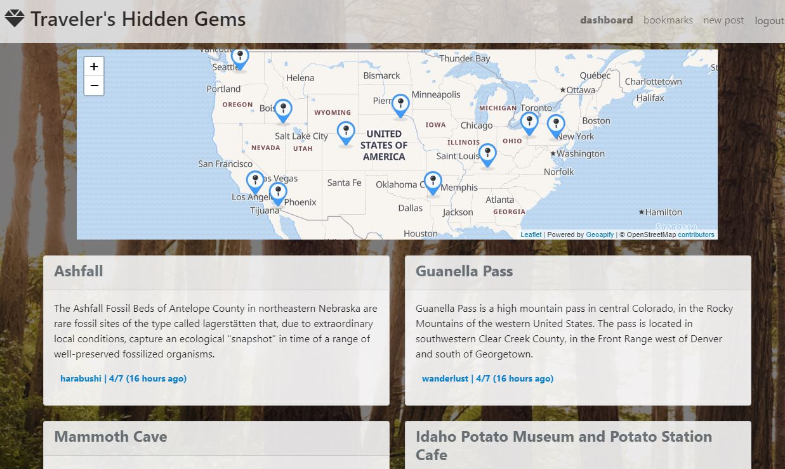

<h1 align="center">Travelers Hidden Gems 👋</h1>

## Description
A travel guide to hidden spots across the globe. Find the offbeat, see something interesting, and share it with others!

Access all this application has to offer by creating a user account.  Once logged in you will be able to create, view, comment, and bookmark places of interest!  Use the well-designed map to view pins of the locations.  
  
Click this [LINK](https://sleepy-woodland-16634.herokuapp.com/) to try the application.   
[](https://choosealicense.com/licenses/mit/)      




## Table of Contents   
* [Usage](#usage)   
* [Installation](#installation)   
* [Technologies Used](#technologies-used)   
* [Heroku](#heroku)
* [Contributors](#contributors)   
* [Questions](#Questions)   
* [License](#license)   


## Usage
To use this app:
```npm start```   
To load seeds in node:
```npm run seeds```   
 
## Installation
To install the dependencies, run the following command:

    "npm install"

## Technologies Used
This app uses:   
Node Package Manager (npm), leaflet.js, GeoApify API, bcrypt, dotenv, express-sessions, Node.js, MySQL, Sequelize ORM, MySQL Workbench, Heroku, Bootstrap, Handlebars.js, OpenStreetMaps, and pexels.

## Heroku
Application deployed on heroku [HERE](https://sleepy-woodland-16634.herokuapp.com/)

## Contributors
[Kartik Jevaji](https://github.com/nitrotap)

[Kate Stensing](https://github.com/kstensing)

[Patrick Lawler](https://github.com/pjlawler)

[Colby Harris](https://github.com/Harabushi)

[Whitney Dawson](https://github.com/whitneydawson123)

## Questions   

Please reach out to me on [GitHub](https://github.com/nitrotap) or by email at kartikinpublic@gmail.com for any additional questions.  


## License
[](https://choosealicense.com/licenses/mit/)

MIT License

Copyright (c) 2022 Colby Harris

Permission is hereby granted, free of charge, to any person obtaining a copy
of this software and associated documentation files (the "Software"), to deal
in the Software without restriction, including without limitation the rights
to use, copy, modify, merge, publish, distribute, sublicense, and/or sell
copies of the Software, and to permit persons to whom the Software is
furnished to do so, subject to the following conditions:

The above copyright notice and this permission notice shall be included in all
copies or substantial portions of the Software.

THE SOFTWARE IS PROVIDED "AS IS", WITHOUT WARRANTY OF ANY KIND, EXPRESS OR
IMPLIED, INCLUDING BUT NOT LIMITED TO THE WARRANTIES OF MERCHANTABILITY,
FITNESS FOR A PARTICULAR PURPOSE AND NONINFRINGEMENT. IN NO EVENT SHALL THE
AUTHORS OR COPYRIGHT HOLDERS BE LIABLE FOR ANY CLAIM, DAMAGES OR OTHER
LIABILITY, WHETHER IN AN ACTION OF CONTRACT, TORT OR OTHERWISE, ARISING FROM,
OUT OF OR IN CONNECTION WITH THE SOFTWARE OR THE USE OR OTHER DEALINGS IN THE
SOFTWARE.
